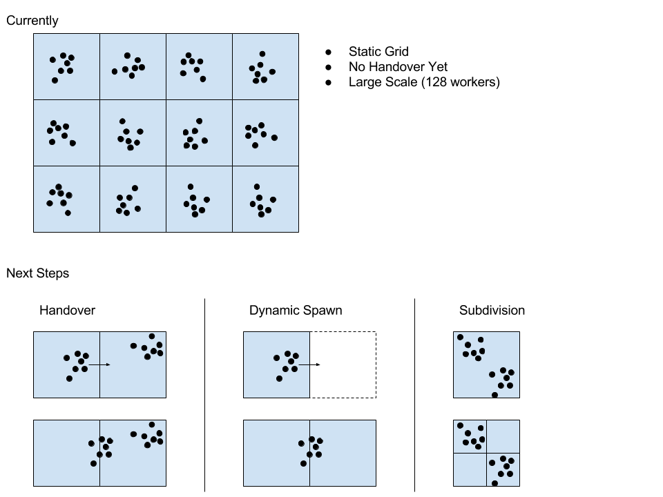

# Spatial Tree Simulation

This repo provides some sample code which spawns many workers across multiple machines, performing O(N^2) simulation on each. Spawning and communication between workers and machines is handled by the Hadean platform.

Progress Diagram

More info on [HackerNews](https://news.ycombinator.com)

More info on [Youtube - 48 Workers](https://www.youtube.com/watch?v=8TgeBZScRmE), [Youtube - 128 Workers](https://www.youtube.com/watch?v=0U0fzF3Fy9E)
