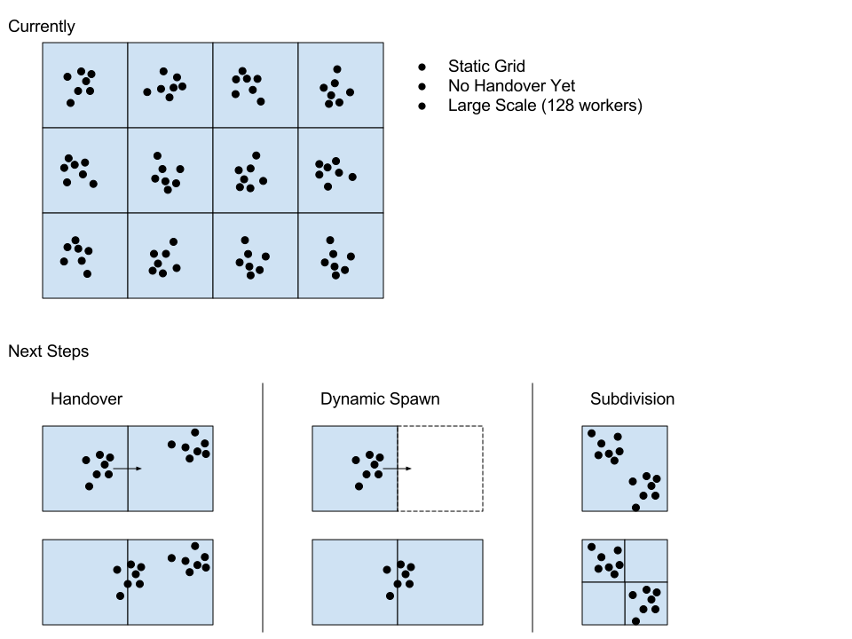
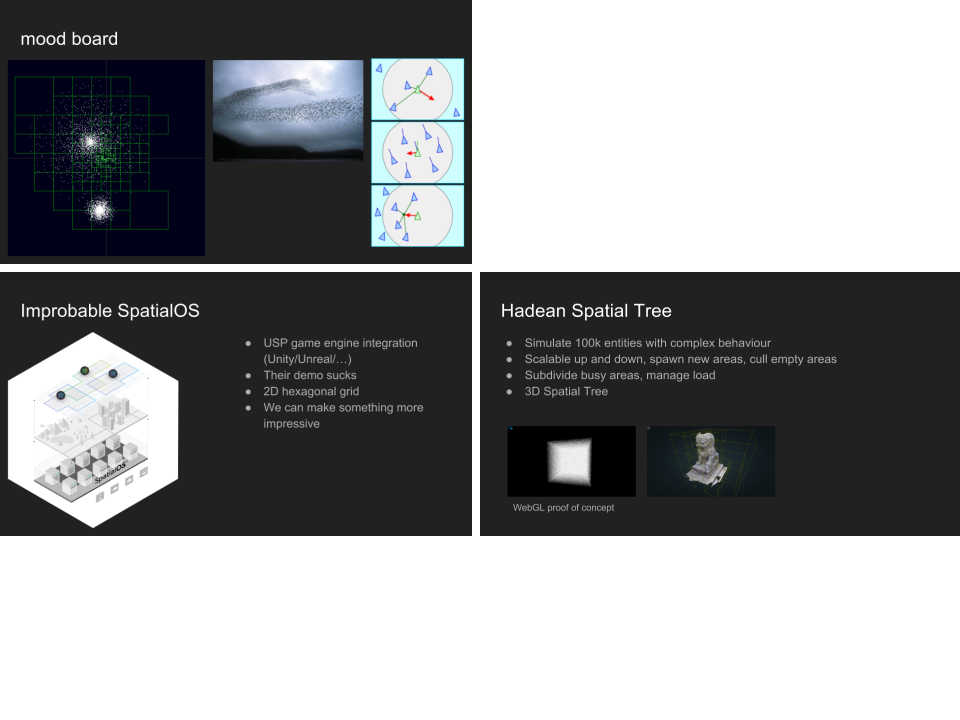

# Spatial Tree Simulation

This repo is a working SpatialOS prototype which spawns many worker processes across multiple machines, performing O(N^2) simulation on each. Spawning and communication between workers and machines is handled by the Hadean platform.

The simulation results are streamed in real-time from a cloud, maxing out our connection at 80mbps, at 128 workers across multiple machines. The code is the same for developing on a small laptop, and running at scale on many machines in the cloud.

The workers are compute bound, doing an O(N^2) simulation on 500 points each. By running many workers (across multiple machines) we can get far past this limit. And the Hadean platform makes all this spawning and communication as simple as running on a single machine.

I've not had to use docker/kubernetes/anything like that as Hadean sorts all that infrastructure management out. I send a single binary to it.

My approach uses an octree with cells stored by Morton (Z-Order) index. A leaf cell in the tree corresponds to a single worker/core. New cells will be dynamically spawned when the entitIes move out of the live area, and despawned when they’re empty. Cells will also be subdivided when the load in a single cell increases beyond a threshold, this will maintain an almost constant amount of computation per worker.

More info on [HackerNews](https://news.ycombinator.com)

More info on [Youtube - 48 Workers](https://www.youtube.com/watch?v=0U0fzF3Fy9E), [Youtube - 128 Workers](https://www.youtube.com/watch?v=8TgeBZScRmE)

Progress Diagram

Motivation

- `src/master.c` is the master process in the cloud, that spawns the workers
- `src/worker.c` is the worker code that runs on each spawned process
- `src/client.c` is the local code which receives points via TCP `src/client-tcp.c` and displays them using OpenGL `src/client-ui.c`
- `src/simulate.c` is where the actual simulation is performed (coulomb attraction/repulsion and swarm behaviour, although swarm behaviour isn't well tested)
